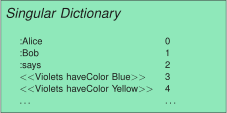
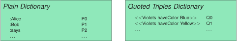
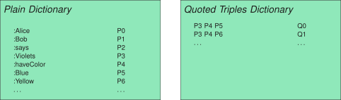
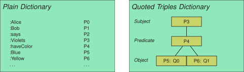

## Indexing Approaches
{:#approaches}

In this section, we introduce four approaches for indexing quoted triples,
with increasing levels of complexity.
These approaches build upon the well-established methods of
using dictionary encoding
and storing triples in different orders
as explained in [](#background).
Our approaches only rely on changes within the dictionary mechanism,
while the triple index itself can remain unchanged.

### Singular Dictionary

A straightforward way to achieve dictionary encoding of quoted triples,
is to include quoted triples directly inside the dictionary with all other RDF terms.
As such, quoted triples are handled in exactly the same manner as other RDF term types.
For dictionaries that map strings to integers, this requires a mechanism to convert quoted triples into strings.
[](#figure-dict-singular) shows an example of such dictionary contents based on our use case data.

<figure id="figure-dict-singular">

<figcaption markdown="block">
Plain terms and quoted triples are stored inside the same dictionary.
</figcaption>
</figure>

Executing triple pattern queries is identical to the baseline approach as explained in [](#background),
except for triple patterns containing quoted variables, such as the query `?person :says <<Violets haveColor ?color>>`.
As this approach has no direct way of matching the `?color` variable to quoted triples,
we are required to convert quoted triple pattern terms containing variables to variables,
and perform a post-processing step to only emit those triples that match the quoted triple pattern.
The pseudo-code of this algorithm is shown in [](#algorithm-query-dict-singular).

<figure id="algorithm-query-dict-singular" class="algorithm">
````/algorithms/query-dict-singular.txt````
<figcaption markdown="block">
Pseudocode of the algorithm for executing triple pattern queries using a singular dictionary.
This algorithm is a variant of `QueryIndex` from [](#algorithm-triplestoreindex-query).
</figcaption>
</figure>

The main advantage of this approach lies in its simplicity of implementation.
However, we hypothesize two main disadvantages:

1. **Storage overhead**: Quoted triples with shared terms lead to a storage overhead, such as the duplicate storage of `:Violets` and `:haveColor` in [](#figure-dict-singular).
2. **Slow quoted triple pattern execution**: When executing triple pattern queries with quoted variables, there is no indexed access to matching quoted triples, which can lead to query performance issues.

### Quoted Triples Dictionary

In an attempt to cope with the two disadvantages of the singular dictionary approach,
we can dedicate the storage of quoted triples to a separate dictionary,
as shown in [](#figure-dict-quoted).

<figure id="figure-dict-quoted">

<figcaption markdown="block">
Plain terms and quoted triples are stored in separate dictionaries.
</figcaption>
</figure>

To execute triple pattern queries in this approach, the post-processing step from the singular dictionary is not needed anymore.
Instead, we can hook directly into the internal processing of separate triple component indexes.
Concretely, when finding all matches of a given term inside a triple component index,
we check if our term is a quoted triple pattern.
If so, we perform an inner join between all quoted triple entries within the quoted triples dictionary,
and the terms within the triple component index.
If the triple component index is index in a hash-like manner, then this inner join can be done efficiently in a hash join manner.
The pseudo-code of this algorithm is shown in [](#algorithm-query-dict-quoted).

<figure id="algorithm-query-dict-quoted" class="algorithm">
````/algorithms/query-dict-quoted.txt````
<figcaption markdown="block">
Pseudocode of the algorithm for finding all matching terms of a certain triple component inside an index using a quoted triples dictionary.
This algorithm is a variant of `QueryIndexComponent` from [](#algorithm-triplestoreindexcomponent-query).
</figcaption>
</figure>

We hypothesize that this separated quoted triples dictionary will result in a lower storage overhead.
Furthermore, we expect triple pattern execution to be faster due to the fact that a quoted triple pattern
will only lead to matches with entries in the quoted triples dictionary,
as opposed to _all_ possible terms.
However, as shown in [](#figure-dict-quoted), this approach can still lead to redundant storage
if terms are shared across different quoted triples, such as `:Violet` and `:haveColor`.
Furthermore, the join inside the triple component index using all quoted triples
might become too expensive if there are many non-matching quoted triples.

### Referential Quoted Triples Dictionary

To solve the redundant storage issue within the quoted triples dictionary approach,
we extend upon that approach by not storing quoted triples in full,
but by instead encoding the three components of that quoted triples,
and using those encodings as key inside the dictionary.
[](#figure-dict-quoted-referential) illustrates an example of this approach.

<figure id="figure-dict-quoted-referential">

<figcaption markdown="block">
Plain terms and quoted triples are stored in separate dictionaries,
where quoted triples are recursively encoded using existing dictionary encodings.
</figcaption>
</figure>

The triple pattern query algorithm is identical to the one from [](#algorithm-query-dict-quoted),
except for the fact that dictionary encoding and decoding will require the extra step of
encoding and decoding of the three triple components.

We hypothesize that this approach will lead to lower storage usage
due to the shared encoding of redundant terms inside quoted triples.

### Indexed Quoted Triples Dictionary

The Quoted Triples Dictionary approach requires triple component indexes to join with all quoted triples,
which may be costly for selective quoted triple patterns in the presence of many non-matching quoted triples.
To solve this problem, we can modify the storage of our Quoted Triples Dictionary
from a map-like structure to a tree-like structure,
so that triple pattern matching can be done more efficiently.
Concretely, this tree-like structure can be implemented similar to a triple index,
but it must map to integer encodings of quoted triples.
[](#figure-dict-quoted-indexed) illustrates an example of this approach.
This example only makes use of the `SPO` order for encodings,
but in practise multiple other collation orders may be used.

<figure id="figure-dict-quoted-indexed">

<figcaption markdown="block">
Plain terms and quoted triples are stored in separate dictionaries,
where quoted triples are recursively encoded using existing dictionary encodings,
and indexed in a tree structure based on triple components.
</figcaption>
</figure>

Executing triple pattern queries is very similar to the approach of the Quoted Triples Dictionary,
with the difference that instead of joining with _all_ quoted triples,
we join with only those quoted triples that match with the current quoted triple pattern.
The pseudo-code of this algorithm is shown in [](#algorithm-query-dict-quoted-indexed).

<figure id="algorithm-query-dict-quoted-indexed" class="algorithm">
````/algorithms/query-dict-quoted-index.txt````
<figcaption markdown="block">
Pseudocode of the algorithm for finding all matching terms of a certain triple component inside an index using an indexed quoted triples dictionary.
This algorithm is a variant of `QueryIndexComponent` from [](#algorithm-triplestoreindexcomponent-query).
</figcaption>
</figure>

We hypothesize that this approach will speed up triple pattern query performance
due to the higher selectivity during joins between the quoted triples dictionary and the current component index.
