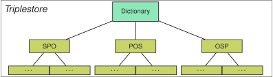

## Background
{:#background}

Indexing is an important and well-understood element of RDF storage systems and SPARQL query engines,
where it provides a trade-off between query execution time, storage space, and ingestion time.
Existing approaches are either based on existing database technologies,
such as [relational databases](cite:cites virtuoso) or [document stores](cite:cites dsparq),
or provide native support for RDF triples.
In the context of this paper, we focus on the latter.
Furthermore, we limit our discussion to the storage of RDF triples
without considering the concept of named graphs,
as these can be considered as fourth element in a quad-like structure,
for which straightforward index extensions are possible.

### Indexes for different orders

A first important concept in RDF indexing is the *storage of triples in different orders*,
which is done by many RDF storage techniques, such as [RDF-3X](cite:cites rdf3x) and [Hexastore](cite:cites hexastore).
Given that a triple consists of
a subject (`S`), predicate (`P`) and object (`O`),
both systems include six indexes for different triple component orders (`SPO`, `SOP`, `OSP`, `OPS`, `PSO` and `POS`).
The presence of these indexes allows all possible triple patterns to be executed efficiently.
For example, the triple pattern query `??O` can be answered most efficiently using the `OSP` or `OPS` indexes,
while the query `S?O` could be answered using `SOP` and `OSP`.
Next to triple pattern access efficiency, these orders also enable more efficient triple pattern join processing inside query engines,
where the highly efficient sort-merge join could for example be used for joins between triple patterns if triples are sorted in the same manner.
RDF-3X goes a step further, and also provides six aggregated indexes (`SP`, `SO`, `PS`, `PO`, `OS`, and `OP`),
and three one-valued indexes (`S`, `P`, and `O`).
The triples inside each index can be stored in different ways, such as ordered lists (Hexastore) or B+Trees (RDF-3X).
Approaches such as [HDT](cite:cites hdt) and [OSTRICH](cite:cites ostrich) go the different direction,
and store fewer indexes (`SPO`, `POS`, `OSP`) to focus purely on the triple pattern access efficiency in combination with a lower storage cost.
In the context of this article, we assume tree-like indexing,
and we refer to the triple component parts of an index as *triple component indexes*.
For example, the `SPO` index would have 3 triple component indexes: `S`, `P`, and `O`.

### Dictionary encoding

A second important aspect in RDF indexing is the *encoding of RDF terms using dictionaries*.
A main purpose of dictionary-encoding is the reduction in storage overhead if RDF terms are reused across multiple triples inside indexes.
The dictionary itself is a datastructure that maintains a bidirectional mapping of RDF terms to their encodings.
Instead of storing RDF terms directly inside indexes, terms are first encoded into a more compact datatype, such as an integer,
which is then stored inside the index instead.
At query time, non-variable triple pattern terms can also be encoded, and queried inside the index.
When returning query results, encoded triples can be decoded using the dictionary.

[](#figure-background-triplestore) shows an illustration of the typical components of a triplestore.
This example store contains three indexes, with triples stored in `SPO`, `POS`, and `OSP` orders in tree-like structure.
These indexes make use of a single shared dictionary, which encodes the RDF terms inside all RDF triples stored by the indexes.

<figure id="figure-background-triplestore">

<figcaption markdown="block">
The different components of a triplestore, containing one dictionary that is used by three indexes.
</figcaption>
</figure>

### Triple Pattern Queries

To simplify discussions involving triple pattern queries,
we outline a traditional high-level query execution approach for triple pattern queries
in [](#algorithm-triplestore-query), [](#algorithm-triplestoreindex-query), and [](#algorithm-triplestoreindexcomponent-query).
As shown in [](#algorithm-triplestore-query), the first step involves determining the most suitable index for a given triple pattern query.
For example, a `??O` query can be answered most efficiently using the `OSP` index.
The triple pattern query is then delegated to the index,
which is executed according to [](#algorithm-triplestoreindex-query).
In this step, we recursively drill down into the tree-like index by iterating over all matching terms of each triple pattern component.
The algorithm for finding all matches for a single triple pattern component is shown in [](#algorithm-triplestoreindexcomponent-query),
which either returns all terms in this part of the index if the term is a variable,
or returns the term itself if the term is inside the index if the term is not a variable.
We will replace parts of these algorithms when introducing our quoted triples indexing approaches in [](#approaches).

<figure id="algorithm-triplestore-query" class="algorithm">
````/algorithms/algorithm-triplestore-query.txt````
<figcaption markdown="block">
Pseudocode for executing a triple pattern query over a triplestore containing one or more indexes.
</figcaption>
</figure>

<figure id="algorithm-triplestoreindex-query" class="algorithm">
````/algorithms/algorithm-triplestoreindex-query.txt````
<figcaption markdown="block">
Pseudocode for executing a triple pattern query over an index, sorted in `SPO` order.
</figcaption>
</figure>

<figure id="algorithm-triplestoreindexcomponent-query" class="algorithm">
````/algorithms/algorithm-triplestoreindexcomponent-query.txt````
<figcaption markdown="block">
Pseudocode for finding all matches of a single triple component inside an index.
</figcaption>
</figure>
