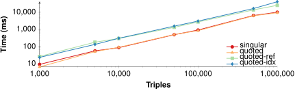
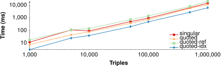
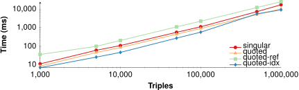
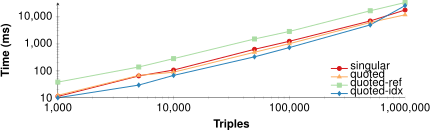
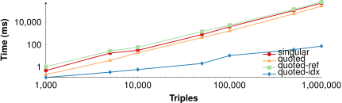
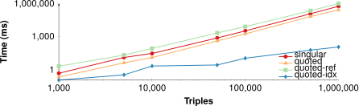
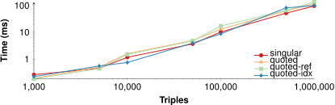
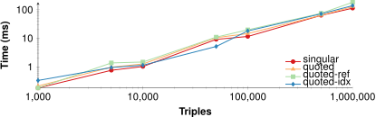
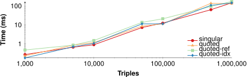
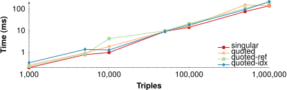

## Evaluation
{:#evaluation}

In this section, we evaluate the impact of the indexing approaches discussed in 
in terms of storage size, ingestion time, and query execution time.
We start by discussing our implementation of the approaches,
followed by our experimental setup, our results,
and end with a discussion.

### Implementation

To achieve a fair comparison between the different indexing approaches,
we have implemented all approaches in the same programming language (TypeScript).
The implementation of these approaches is open-source,
and available on GitHub at [https://github.com/rubensworks/rdf-stores.js](https://github.com/rubensworks/rdf-stores.js).

### Experimental Setup

To measure the performance impact of different quoted triple depths,
we create simulated datasets at various sizes.

Our dataset generator is based on the data model of  with different people (size / 10) and colors (10),
and allows any number of triples to be generated.
Furthermore, it allows a *depth* parameter to be specified, which defines the number of quoted triples in object positions.
For instance, a depth value of 1 generates quoted triples in the form of `?person :says << :Violets :haveColor ?color >>`,
while a depth value of 3 generated quoted triples in the form of `?person :says << ?person :says << ?person :says << :Violets :haveColor ?color >> >> >>`.

For our experiments, we range the dataset from 1.000 to 1.000.000,
with the depth ranging from 1 to 5.
For each combination, we measure the performance of the four indexing approaches in terms of the following metrics:

* **Storage size**: The total memory consumption after ingestion in MB.
* **Ingestion time**: The duration of ingesting the generated triples in milliseconds.
* **Query execution time**: The total duration of executing all triple pattern queries in milliseconds.

Query execution was measured using 3 types of queries (examples assume depth 2):

* **Low selectivity**: Query people in the form of: `?person :says << ?person :says << :Violets :haveColor :Red >> >>`. Each query produces size / 10 results.
* **Medium selectivity**: Query colors in the form of: `?person :says << :Bob :says << :Violets :haveColor ?color >> >>`. Each query produces 10 results.
* **Medium selectivity**: Query colors of specific people in the form of: `:Alice :says << :Bob :says << :Violets :haveColor ?color >> >>`. Each query produces 1 results.

The 4 indexing approaches were configured with 3 indexes (`SPO`, `POS`, `OSP`),
and the indexed quoted triples dictionary was also configured with these 3 indexes.
All experiments were executed on a MacBook Pro 13-inch, 2020 with 16GB or RAM and a 2,3 GHz Quad-Core Intel Core i7 processor.
Our experimental setup is fully reproducible, and is available together with the raw results at
[https://github.com/rubensworks/experiments-indexing-quoted-triples](https://github.com/rubensworks/experiments-indexing-quoted-triples).

### Results

 and  respectively show the storage sizes and ingestion times
for the different indexing approaches.
, , and 
respectively show the query execution times for low, medium, and high selectivity queries.
We omit results for quoted triple depths that do not provide additional insights aside from the highest and lowest values.
To show an overview of all storage sizes, all figures are logarithmic in both axes.

<figure id="figure-results-ingest-size" class="results-sidebyside">

<figure id="figure-results-ingest-size-1" class="subfigure">

<figcaption markdown="block">
Depth 1
</figcaption>
</figure>

<figure id="figure-results-ingest-size-5" class="subfigure">

<figcaption markdown="block">
Depth 5
</figcaption>
</figure>

<figcaption markdown="block">
Storage sizes for the 4 indexing approaches with increasing dataset sizes.
</figcaption>
</figure>

<figure id="figure-results-ingest-time" class="results-sidebyside">

<figure id="figure-results-ingest-time-1" class="subfigure">

<figcaption markdown="block">
Depth 1
</figcaption>
</figure>

<figure id="figure-results-ingest-time-5" class="subfigure">

<figcaption markdown="block">
Depth 5
</figcaption>
</figure>

<figcaption markdown="block">
Ingestion times for the 4 indexing approaches with increasing dataset sizes.
</figcaption>
</figure>

<figure id="figure-results-query-low" class="results-sidebyside">

<figure id="figure-results-query-low-1" class="subfigure">

<figcaption markdown="block">
Depth 1
</figcaption>
</figure>

<figure id="figure-results-query-low-3" class="subfigure">

<figcaption markdown="block">
Depth 3
</figcaption>
</figure>

<figure id="figure-results-query-low-4" class="subfigure">

<figcaption markdown="block">
Depth 4
</figcaption>
</figure>

<figure id="figure-results-query-low-5" class="subfigure">

<figcaption markdown="block">
Depth 5
</figcaption>
</figure>

<figcaption markdown="block">
Query execution times for the 4 indexing approaches with increasing dataset sizes with low result selectivity.
</figcaption>
</figure>

<figure id="figure-results-query-med" class="results-sidebyside">

<figure id="figure-results-query-med-1" class="subfigure">

<figcaption markdown="block">
Depth 1
</figcaption>
</figure>

<figure id="figure-results-query-med-3" class="subfigure">

<figcaption markdown="block">
Depth 3
</figcaption>
</figure>

<figure id="figure-results-query-med-4" class="subfigure">

<figcaption markdown="block">
Depth 4
</figcaption>
</figure>

<figure id="figure-results-query-med-5" class="subfigure">

<figcaption markdown="block">
Depth 5
</figcaption>
</figure>

<figcaption markdown="block">
Query execution times for the 4 indexing approaches with increasing dataset sizes with medium result selectivity.
</figcaption>
</figure>

<figure id="figure-results-query-high" class="results-sidebyside">

<figure id="figure-results-query-high-1" class="subfigure">

<figcaption markdown="block">
Depth 1
</figcaption>
</figure>

<figure id="figure-results-query-high-3" class="subfigure">

<figcaption markdown="block">
Depth 3
</figcaption>
</figure>

<figure id="figure-results-query-high-4" class="subfigure">

<figcaption markdown="block">
Depth 4
</figcaption>
</figure>

<figure id="figure-results-query-high-5" class="subfigure">

<figcaption markdown="block">
Depth 5
</figcaption>
</figure>

<figcaption markdown="block">
Query execution times for the 4 indexing approaches with increasing dataset sizes with high result selectivity.
</figcaption>
</figure>

### Discussion

{:.todo}
Analyze results
