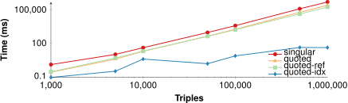
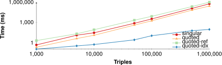
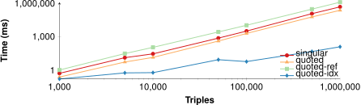
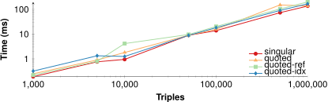

## Evaluation
{:#evaluation}

In this section, we evaluate the impact of the indexing approaches discussed in 
in terms of storage size, ingestion time, and query execution time.
We start by discussing our implementation of the approaches,
followed by our experimental setup, results,
and end with a discussion.

### Implementation

To achieve a fair comparison between the different indexing approaches,
we have implemented all approaches in the same programming language (TypeScript/JavaScript).
The implementation of these approaches is open-source,
and is available on GitHub at [https://github.com/rubensworks/rdf-stores.js](https://github.com/rubensworks/rdf-stores.js).

### Experimental Setup

To measure the performance impact of different quoted triple depths,
we create synthetic datasets of various sizes.
Our dataset generator is based on the data model of  with different people (size / 10) and colors (10),
and allows any number of triples to be generated.
Furthermore, it allows a *depth* parameter to be specified, which defines the nesting depth of quoted triples in object positions.
For instance, a depth value of 1 generates quoted triples in the form of `?person :says << :Violets :haveColor ?color >>`,
while a depth value of 3 generated quoted triples in the form of `?person :says << ?person :says << ?person :says << :Violets :haveColor ?color >> >> >>`.

For our experiments, we range the dataset from 1.000 to 1.000.000,
with the depth ranging from 1 to 5.
For each combination, we measure the performance of the four indexing approaches in terms of the following metrics:

* **Storage size**: The total memory consumption after ingestion in MB.
* **Ingestion time**: The duration of ingesting the generated triples in milliseconds.
* **Query execution time**: The total duration of executing all triple pattern queries in milliseconds.

Query execution time was measured using 3 categories of queries (examples assume depth 2):

* **Low selectivity**: Query people in the form of: `?person :says << ?person :says << :Violets :haveColor :Red >> >>`. Each query produces size / 10 results.
* **Medium selectivity**: Query colors in the form of: `?person :says << :Bob :says << :Violets :haveColor ?color >> >>`. Each query produces 10 results.
* **High selectivity**: Query colors of specific people in the form of: `:Alice :says << :Bob :says << :Violets :haveColor ?color >> >>`. Each query produces 1 results.

The four indexing approaches were configured with three indexes (`SPO`, `POS`, `OSP`),
and the indexed quoted triples dictionary was also configured with these three indexes.
All experiments were executed on a MacBook Pro 13-inch, 2020 with 16GB or RAM and a 2,3 GHz Quad-Core Intel Core i7 processor.
Our experimental setup is fully reproducible, and is available together with the raw results at
[https://github.com/rubensworks/experiments-indexing-quoted-triples](https://github.com/rubensworks/experiments-indexing-quoted-triples).

### Results

 and  respectively show the storage sizes and ingestion times
for the different indexing approaches.
, , and 
respectively show the query execution times for low, medium, and high selectivity queries.
We omit results for quoted triple depths that do not provide additional insights aside from the highest and lowest values.
To show an overview of all storage sizes, all figures are logarithmic in both axes.

<figure id="figure-results-ingest-size" class="results-sidebyside">

<figure id="figure-results-ingest-size-1" class="subfigure">

<figcaption markdown="block">
Depth 1
</figcaption>
</figure>

<figure id="figure-results-ingest-size-5" class="subfigure">

<figcaption markdown="block">
Depth 5
</figcaption>
</figure>

<figcaption markdown="block">
Storage sizes for the 4 indexing approaches with increasing dataset sizes.
</figcaption>
</figure>

<figure id="figure-results-ingest-time" class="results-sidebyside">

<figure id="figure-results-ingest-time-1" class="subfigure">

<figcaption markdown="block">
Depth 1
</figcaption>
</figure>

<figure id="figure-results-ingest-time-5" class="subfigure">

<figcaption markdown="block">
Depth 5
</figcaption>
</figure>

<figcaption markdown="block">
Ingestion times for the 4 indexing approaches with increasing dataset sizes.
</figcaption>
</figure>

<figure id="figure-results-query-low" class="results-sidebyside">

<figure id="figure-results-query-low-1" class="subfigure">

<figcaption markdown="block">
Depth 1
</figcaption>
</figure>

<figure id="figure-results-query-low-3" class="subfigure">

<figcaption markdown="block">
Depth 3
</figcaption>
</figure>

<figure id="figure-results-query-low-4" class="subfigure">

<figcaption markdown="block">
Depth 4
</figcaption>
</figure>

<figure id="figure-results-query-low-5" class="subfigure">

<figcaption markdown="block">
Depth 5
</figcaption>
</figure>

<figcaption markdown="block">
Query execution times for the 4 indexing approaches with increasing dataset sizes with low result selectivity.
</figcaption>
</figure>

<figure id="figure-results-query-med" class="results-sidebyside">

<figure id="figure-results-query-med-1" class="subfigure">

<figcaption markdown="block">
Depth 1
</figcaption>
</figure>

<figure id="figure-results-query-med-3" class="subfigure">

<figcaption markdown="block">
Depth 3
</figcaption>
</figure>

<figure id="figure-results-query-med-4" class="subfigure">

<figcaption markdown="block">
Depth 4
</figcaption>
</figure>

<figure id="figure-results-query-med-5" class="subfigure">

<figcaption markdown="block">
Depth 5
</figcaption>
</figure>

<figcaption markdown="block">
Query execution times for the 4 indexing approaches with increasing dataset sizes with medium result selectivity.
</figcaption>
</figure>

<figure id="figure-results-query-high" class="results-sidebyside">

<figure id="figure-results-query-high-1" class="subfigure">

<figcaption markdown="block">
Depth 1
</figcaption>
</figure>

<figure id="figure-results-query-high-3" class="subfigure">

<figcaption markdown="block">
Depth 3
</figcaption>
</figure>

<figure id="figure-results-query-high-4" class="subfigure">

<figcaption markdown="block">
Depth 4
</figcaption>
</figure>

<figure id="figure-results-query-high-5" class="subfigure">

<figcaption markdown="block">
Depth 5
</figcaption>
</figure>

<figcaption markdown="block">
Query execution times for the 4 indexing approaches with increasing dataset sizes with high result selectivity.
</figcaption>
</figure>

### Discussion

#### Storage size

The results from  show that in terms of storage size,
the singular dictionary and referential quoted triples dictionary approaches perform the best.
The quoted triples dictionary and indexed quoted triples dictionary approaches on the other hand require significantly more memory.
Contrary to what we hypothesized in , the storage overhead of the singular dictionary for terms inside quoted triples
is less significant than expected, and the gains from the removal of storage redundancy with the referential quoted triples dictionary are minimal.
The indexed quoted triples dictionary approach results in a significantly higher storage size due to the three indexes that are used to index quoted triples.

#### Ingestion time

As expected, we observe similar results in terms of ingestion time in ,
where the singular dictionary and quoted triples dictionary are significantly faster than the referential and indexed quoted triples dictionary approaches.
These approaches are faster due to their simpler encoding approach,
whereas the referential and indexed quoted triples dictionary approaches require more operations during triple encoding.

#### Query execution time

The results in , , and 
show that on average, the indexed quoted triples dictionary approach vastly outperforms all other approaches.
This is most significant for triple patterns with medium selectivity due to the fact that this approach
has indexes corresponding exactly to these queries, while the other approaches require iteration over all quoted triples.
For triple patterns with low selectivity, the difference is smaller, but the indexed quoted triples dictionary approach is still faster overall.
The difference for triple patterns with high selectivity is minimal,
as the overhead of triple pattern dictionary encoding during query execution
when fetching a single result becomes more apparent.
